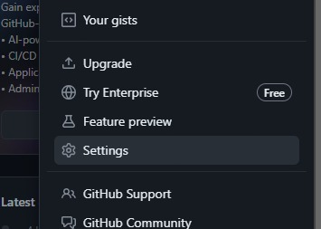
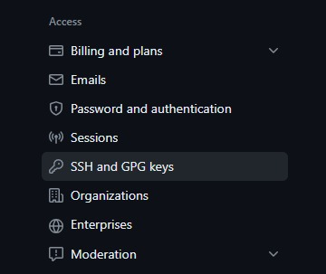
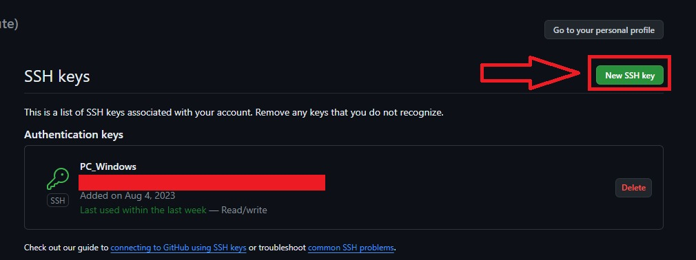
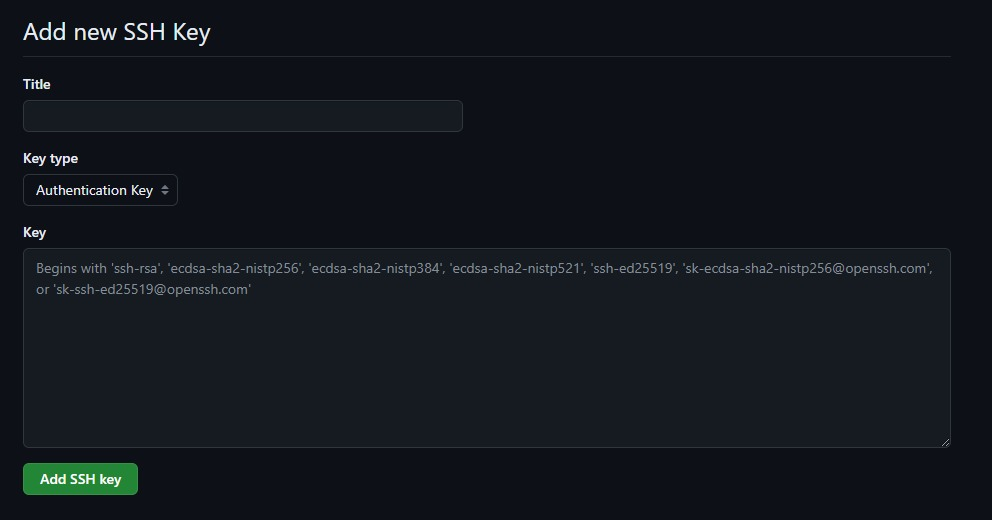

# Autenticación con SSH

Al instalar git, lo primero que debemos hacer es abrir la terminal de Git Bash. Una vez en ella, debemos inicializar Git, lo que podemos hacer con:

```
git init
```
Este comando inicializará git y creara, en un primer momento, un repositorio vacío en el directorio en donde estemos ubicado. El término "git" nos indica que ingresaremos un comando de Git, mientras que "init" inicializa Git en ese directorio.

## Creando el directorio

Lo siguiente, es crear las claves y elementos necesarios para conectarnos vía SSH (Protocolo Secure Shell), pueden consultar más información al respecto en la documentación [oficial de Github](https://docs.github.com/es/authentication/connecting-to-github-with-ssh/about-ssh "Documentación de Github sobre SSH"). Para generar estas claves, debemos cerciorarnos de que en la carpeta del sistema tenemos un directorio llamado ".ssh"; si no lo tenemos, podemos crearlo y movernos a él con:

```
mkdir .ssh
cd .ssh
```

El término "mkdir" crea un directorio desde la terminal bash, mientras que el término "cd" nos mueve al directorio cuyo nombre escribamos. En concreto, secreó un directorio llamado "ssh" (el punto indica que es una carpeta oculta) y nos movimos dentro de dicho directorio.


## Generación de la clave pública y privada

Una vez dentro, y siguiendo la documentación de Git y Github, debemos tipear:

```
ssh-keygen -t ed25519 -C "your_email@example.com"
```

"ssh-keygen" es el comando principal, nos indica que generaremos un par de claves ssh, que se compone de una clave pública y una privada.

Por su parte, la "-t" nos habla del tipo de algoritmo de cifrado que usaremos, así que una vez agregado el parámetro "-t", debemos indicarle en su argumento qué cifrado queremos.

Ahú es donde entra el término "ed25519", que hace referencia al algoritmo de firma digital de curva de Edwards (EdDSA), el mecanismo de encriptación que se emplea más a menudo en la actualidad y el recomendado. Si el sistema no admite dicho mecanismo, puede probarse también con:

```
ssh-keygen -t rsa -b 4096 -C "your_email@example.com"
```
El parámetro "-C" solo nos indica que podemos agregar un comentario. El comentario se incluye en la clave pública y se puede usar para identificar la clave. En este caso, el comentario se establece como tu dirección de correo electrónico.

Al ejecutar este comando, se te pedirá que introduzcas una frase de contraseña dos veces. La frase de contraseña es opcional, pero se recomienda usarla para agregar una capa adicional de seguridad a tus claves. En caso de no colocarla, no te preocupes, pero eso sí: si decides usar una frase de contraseña, asegúrate de que sea algo que puedas recordar fácilmente, pero que sea difícil de adivinar para otras personas.

Ten en cuenta que, una vez generadas las claves, estas se guardarán en un archivo que, habitualmente, lleba el nombre del algoritmo de cifrado (aunque si te lo pregunta, puedes cambiarlo). Se generarán dos archivos, uno contendrá la clave privada y otro la clave pública, este último tendrá una extensión .pub (que en Windows puede confundirse con los archivos de Publisher de la suite de Office). Ingresa en el archivo con la terminación ".pub" (de pública), ábrelo con el blog de notas y copia su contenido.

## Vinculación mediante ssh con la cuenta de Github

Lo que has copiado es el hash de la clave pública, el cual deberás copiar dentro de tu cuenta de git. Para ello dirígiete a tu foto de perfil, haz click en ella y busca "configuración" o "settings" hacia la parte baja del menú:



Una vez en nuestra página de configuración, en la barra de navegación de la izquierda deberemos buscar la sección "Access", o de acceso, y localizar en ella "SSH and GPG keys". Damos click allí.



Una vez dentro del nuevo panel, debemos dar click donde dice "New SSH key":



El resultado será una página como esta:



En el título podemos poner el nombre de nuestra conveniencia, puede ser uno que nos sirva para identificar el dispositivo desde el cual estamos conectándonos (al instalar git en un dispositivo diferente y querer conectarlo con nuestro repositorio de Github, debemos generar una clave ssh nueva, sin necesidad de borrar la anterior). No tocaremos el campo "Key type", y en donde dice key, pegaremos el contenido que hemos copiado del documento .pub que generamos previamente.

De esta forma hemos terminado de configurar nuestro git local para que pueda comunicarse con los repositorios que creemos en nuestra cuenta de Github.