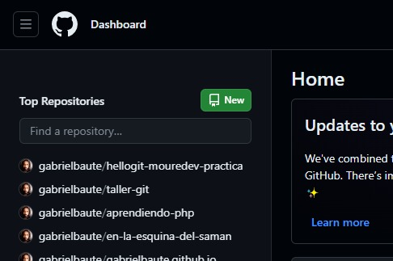
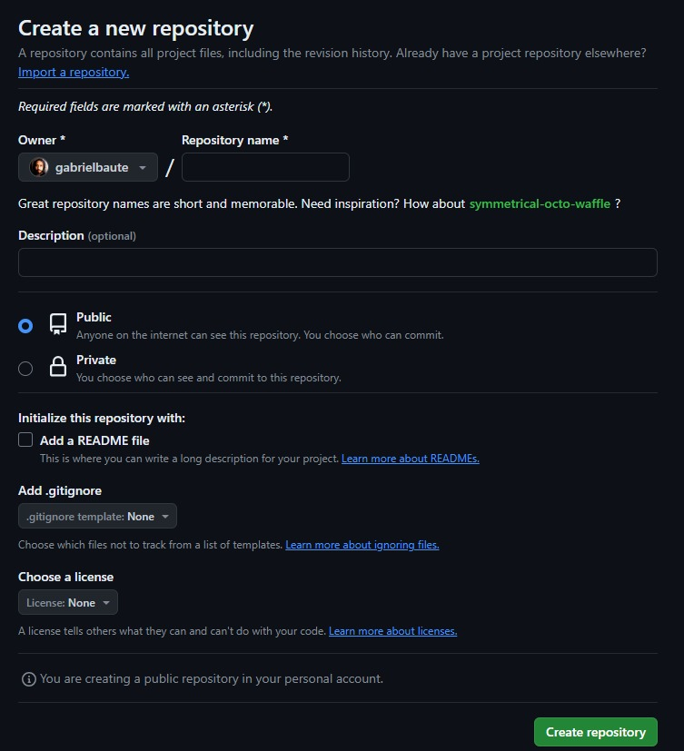
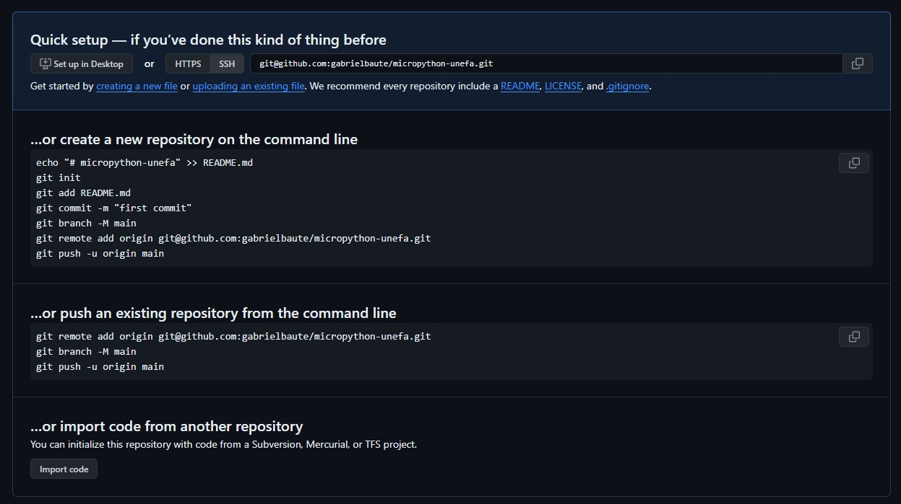

# Creando un repositorio

Si bien puedes llevar un control de tu proyecto en local, dentro de tu equipo, con la ayuda de git, no puedes "empujar" (hacer push) desde tu equipo hacia github directamente, deberás crear un nuevo repositorio desde la interfaz web de github (indicando nombre, si debe incluir un .gitignore y si vas a incluir un archivo README).

## Crear el repositorio

Para crear un nuevo repositorio, podemos hacerlo desde la página principal de github entrando en:

Después de dar click en "New" o "Nuevo", seremos direccionados a la siguiente pantalla:

Lo primero será escoger el nombre del repositorio, el cual github verificará que no se encuentra ya en uso, puesto que te asignará una URL. Puedes agregarle una breve descripción (lo que es opcional), que sirve para que las personas, al ingresar (o en el buscador) puedan tener una noción rápida de lo que trata tu proyecto.

## Repositorio público o privado

Lo siguiente es escoger si el repositorio será público (accesible para todo el mundo) o privado (tu escoges quiénes pueden ver el repositorio, aunque solo podrán si esas personas tienen también una cuenta de github).

## El archivo README.md

El siguiente parámetro es el archivo README. Este es un archivo de markdown en el que agregamos una descripción más detallada y concisa del funcionamiento de nuestro proyecto, la información que pueda ser necesaria y el cómo usarlo, etc. Eres libre de colocar aquí la información que consideres útil y requerida.

## El archivo .gitignore y la licencia

El archivo .gitignore es para listar los archivos o directorios que quieres que git ignore cuando realices un push (cuando envíes los archivos desde tu equipo hacia el repositorio de github).

Y por últim, la licencia se refiere al tipo de licencia de uso que va a tener tu código.

## El repositorio ha sido creado

Una vez verificados todos estos criterios, solo le damos click en donde dice **Create repository**, y pasaremos a una ventana como esta:

En ella podemos ver dónde y cómo vincular nuestro repositorio con nuestro proyecto en local. El método recomendado para estas clases es mediante ssh.